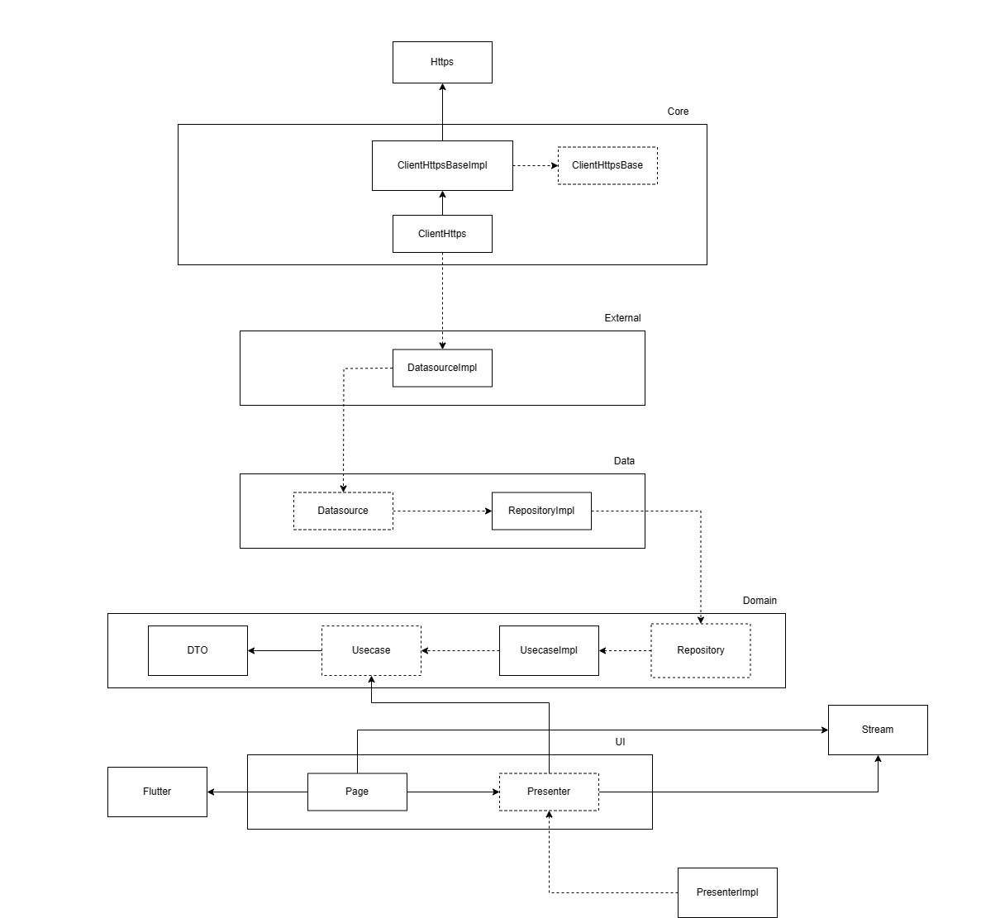
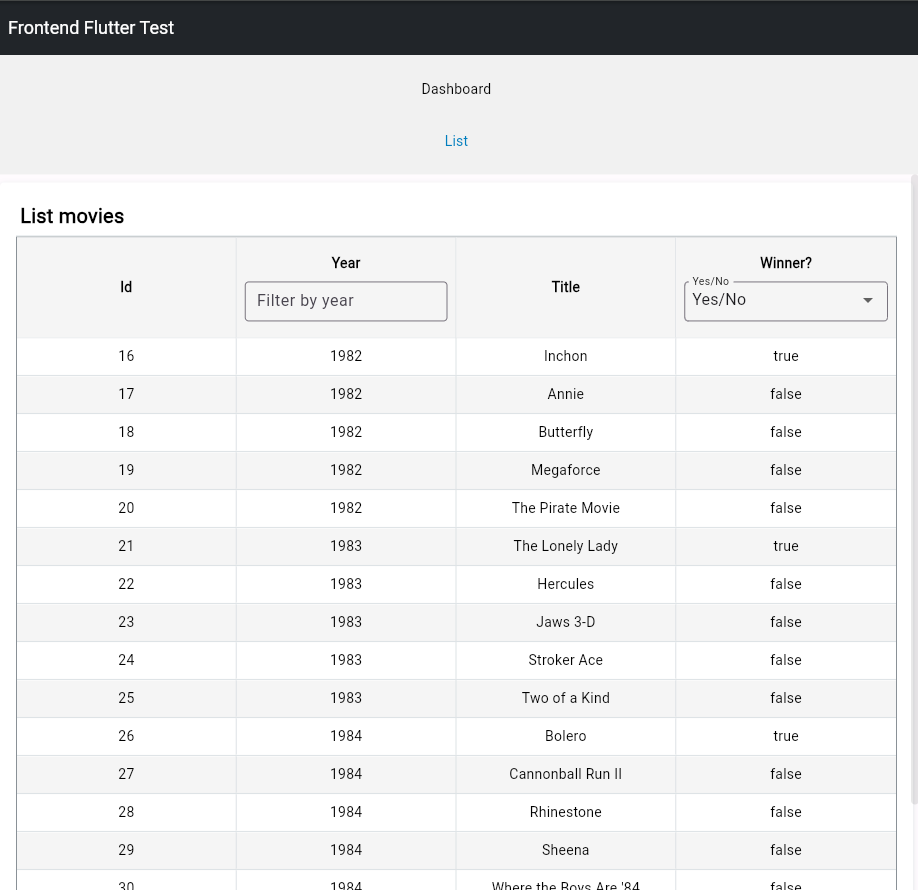

  <row>
    
    
  </row>

  <h3>Razzies App</h3>
  
Razzies APP is a mobile/web responsive application in development using Flutter, This application presents a reading of the list of nominees and winners in the Worst Film category of the Golden Raspberry Awards.

 

## Overview
1. **[Requirements 📝](#requirements-)**
2. **[Developing 👷](#developing-)**
3. **[Releasing 🏷️](#releasing-)**
4. **[Architecture Diagram ⚙️](#architecturediagram-)**
5. **[App Images 📱](#appimages-)**

## Requirements 📝
#### To execute this project it is necessary to have the following dependencies installed and configured on your machine:

**Required**
- [Flutter](https://flutter.dev/)
- [Android SDK](https://developer.android.com/studio)
- [IOS SDK](https://developer.apple.com/xcode/)

**Versions**
- [Flutter](https://flutter.dev/) `3.19.5`
- [Dart](https://dart.dev/) `3.3.3`

## Developing 👷
#### Use a local development environment:

1. [Clone this repo](https://docs.gitlab.com/ee/gitlab-basics/start-using-git.html) with git.
2. Install dependencies by running `flutter packages get` or `flutter pub get` within the directory that you cloned (probably `app`).
3. Open any mobile device emulator of your choice our selected the chrome application.
4. Execute your app with `flutter run` or F5 (debug mode), if you want execute in specific platform execute `flutter run -d {device}` (e.g., chrome), with you want execute in specific port use `flutter run -d web-server --web-port=8080` and type http://localhost:8080 in any navigator.

## Releasing 🏷️

1. [Clone this repo](https://docs.gitlab.com/ee/gitlab-basics/start-using-git.html) with git.
2. Install dependencies by running `flutter packages get` or `flutter pub get` within the directory that you cloned (probably `app`).
3. Build the release files with `flutter build apk` our `flutter build web`.
4. Find the your release in `build/app/outputs/apk/release` or `build/app/outputs/flutter-apk/release`.

## Architecture Diagram

This architecture is based in Clean Architecture and SOLID principles, and the UI layer is based in MVP principles.
Below is an image of the architecture.

  <row>
    
  </row>

## App Images

This section shows images of application in the different's dimensions.

  <row>
    
  </row>

  <row>
    
  </row>

  <row>
    
  </row>

  <row>
    
  </row>

  <row>
    
  </row>

  <row>
    
  </row>

